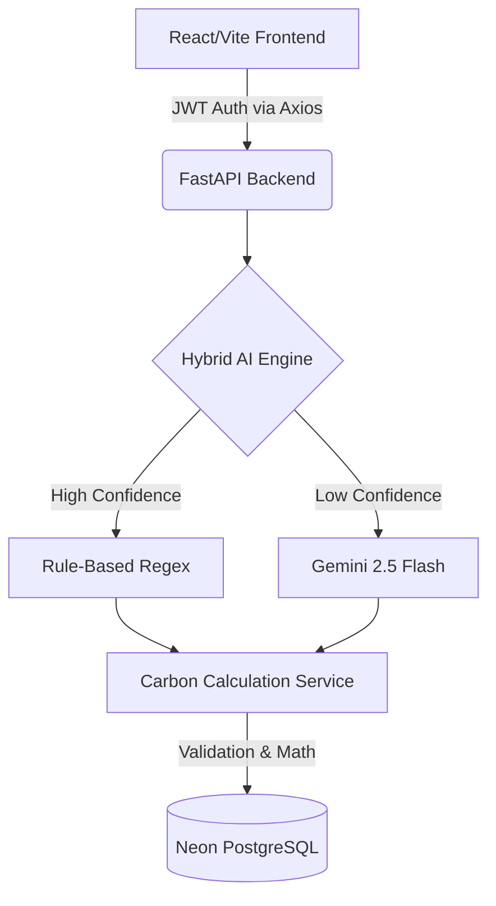

# CarbonLens Showcase

## 1. Project Overview
CarbonLens is a modern, production-ready web application that helps users effortlessly track and visualize their personal carbon footprints. By combining deterministic scientific carbon coefficients with an advanced Natural Language AI Engine, CarbonLens removes the friction from traditional carbon accounting.

## 2. Key Features
- **AI Natural Language Diary**: Users can type "I drove 15km and ate a chicken meal", and the system instantly extracts and logs the exact carbon footprint.
- **Cost-Free Hybrid Extraction Architecture**: A lightning-fast custom regex rules-engine intercepts 50%+ of prompts for free, only falling back to Google Gemini Flash API when sentences become too complex.
- **Single Source of Truth**: The AI is intentionally blocked from performing math, ensuring it never hallucinates emissions. All extracted variables route through a strict, centralized Python Calculation Engine.
- **Dynamic Analytics Dashboard**: Leverages PostgreSQL `date_trunc` aggregations to display a personalized Carbon Score, category breakdowns, and a 14-day emission trend.

## 3. Screenshots
*(Placeholder for actual application screenshots - check `walkthrough.md` for generated assets)*

## 4. Architecture Diagram

## 5. AI Workflow
1. User submits unstructured text to the `/activities/extract` endpoint.
2. The Rule-Based engine attempts to parse quantities, units, and categories. If confidence drops below 80%, it hands the string to Gemini.
3. The AI returns a strict JSON array (via `response_mime_type="application/json"`).
4. The backend dry-runs the JSON through Pydantic validators and sends a calculated preview back to the React UI.
5. User hits "Confirm & Save", hitting the `/activities/bulk` endpoint to safely persist to the database.

## 6. Carbon Calculation Workflow
All parameters (e.g., `10 miles car`) are normalized (`10 miles -> 16.09 km`) by the centralized Calculation Service. It cross-references strict dictionaries (e.g. `0.19 kg CO2/km`) to calculate the exact emission, appending a human-readable `calculation_explanation` to the payload.

## 7. Technology Stack
- **Frontend**: React 19, TypeScript, Vite, Tailwind CSS, Chart.js, React-Router
- **Backend**: Python 3.10+, FastAPI, SQLAlchemy, Alembic, Pydantic
- **Database**: PostgreSQL (Neon Serverless)
- **AI Integration**: `google-generativeai` (Gemini 2.5 Flash)
- **Deployment Strategy**: Vercel (Frontend), Render (Backend)

## 8. Deployment Links
- **Live Frontend**: https://carbonlens-sage.vercel.app/
- **Live API Endpoint**: https://carbonlens-backend-1em1.onrender.com
- **Swagger Documentation**: `[Insert Render URL]/docs`

## 9. Future Improvements
- **Social Leaderboards**: Allowing friends to compete on Carbon Scores.
- **Budgeting**: Alerting users when they approach their weekly emission limit.
- **Receipt Parsing**: Expanding the AI engine to read grocery receipts via image uploads.
